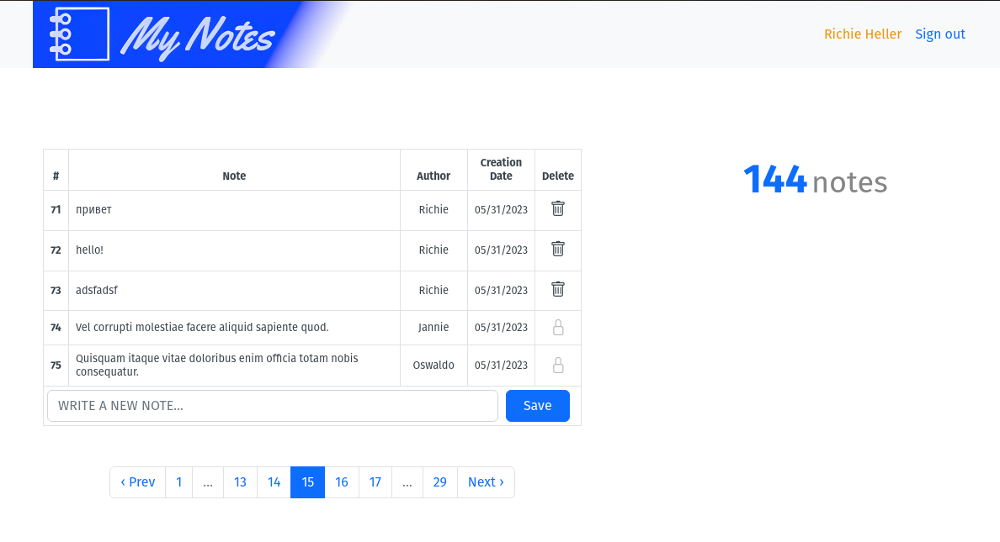

"My notes"
===
Демонстрационное приложение.

Включает функцию регистрации и входа в систему для пользователей.
Пользователь может добавлять и удалять (свои) заметки.
Заметки отображаются в таблице, с сортировкой записей по
дате создания. Используется пагинация, присутствуют всплывающие подсказки.

Развернуто на [render.com](https://mynotes-2jaw.onrender.com/) (может потребовать некоторого ожидания)



### Технологии:

* Ruby/Ruby on Rails (3.1.1/7.0.4);

* PostgreSQL;

* Hotwire/Bootstrap;

* Rspec; 

### Настройка и запуск приложения локально:

###### (Для работы приложения требуется наличие предустановленных Ruby 3.1.1, PostgreSQL >= 9.3)

1. Клонировать репозиторий: ```git clone git@github.com:axmaxon/my_notes.git```

2. Перейдите в каталог приложения ```cd my_notes```

3. ```cp .env.example .env```

4. ```editor .env``` отредактируйте имя пользователя и пароль для доступа к вашей базе данных.

5. ```bundle install```

6. ```yarn install```

7. ```rails db:setup```

8. ```editor config/application.rb``` установите ваш часовой пояс: ```config.time_zone = YOUR_TIMEZONE```
   (посмотреть варианты timezones можно с помощью `rails time:zones:all`)

9. Запустить приложение: ```foreman start -f Procfile.dev``` (или просто ```bin/dev```)
